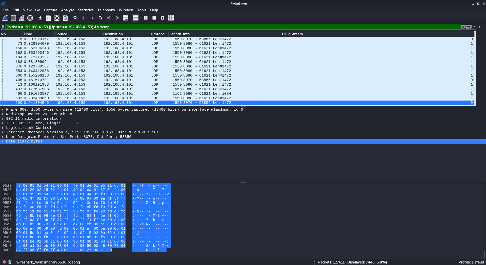

# BigSun

## Prelude 
I decided to do a write up on this project to discover vulnerabilities/craft exploits/write implants regardless of whether or not I was successful. I think this is beneficial for a few reasons: I can get feedback on different things to try, people can see how I think, and as an industry, we could stand to post our failures more. When I first started out in the security industry, it was incredibly intimidating to see a blog with twenty CVEs and all this amazing content, but no posts discussing failures.

## Hardware
I went to eBay and bought the SKETCHIEST hardware I could find, in this case, I got a ["Spy Camera"](https://www.ebay.com/itm/284128949863) ([Wayback Archive Link](https://web.archive.org/web/20210524174343/https://www.ebay.com/itm/284128949863)). The premise is simple, you can connect directly to the device via the WiFi network it broadcast, and either just stream directly to your device, or you can tell it to connect to another WiFi network. It also has the ability to save video to a microSD onboard the device.

I had a pretty hard time getting this all set up, it looks like the Android app is totally broken, and refuses to connect to the camera correctly; I couldn't get video streamed to my phone, nor could I tell the camera to connect to another WiFi network. I ended up having to install the app on my iPad which worked. From there I could start getting to work.

## Inspecting the Network
So obviously this was generating regular WiFi traffic because multiple devices were able to connect to the device's hotspot/WiFi network, and my iPad could receive the video. I booted up Wireshark with my Ralink WiFi adapter in monitor mode to snoop on the traffic. I found the camera's MAC Address by looking for the 802.11 Beacon Frame packets that had the SSID corresponding to it. From there I saw that there were two IP addresses communicating back and forth, which would be the camera and my iPad, via some UDP ports. It looks like large chunks of data were streaming from port 8080 and 8070 on the camera to my iPad.



At first glance, these packets just seem like nonsense binary data. My initial concern is that it would be encrypted, but after inspecting some of the traffic, I saw `JFIF` in the UDP data. I had a hunch, and looked up what the [magic bytes](https://en.wikipedia.org/wiki/List_of_file_signatures) are for the JPEG file format, and it ended up being `JFIF`!


It looks like every seven UDP packets on port 8080 had the `JFIF` string in it, so this was probably an MJPEG stream (basically a bunch of JPEG images in quick succession to make a "movie"). Since I knew what the [JPEG file structure](https://en.wikipedia.org/wiki/JPEG_File_Interchange_Format#File_format_structure) looked like, I could try to carve it from the UDP stream. Basically, I just have to start from `FF D8` and end at `FF D9`. I copied the bytes from the start to the end of the image, and threw them into the Python snippet below:

```python
>>> s = """ <SNIP> """
>>> s = s.replace('\n','')
>>> b = bytes.fromhex(s)
>>> open('test.jfif', 'wb').write(b)
```

But unfortunately the following image was produced (for reference, it should be a weird angle of half the chair that's in my office (plz don't d0x me)):


I tried out a few different packet sets to extract the image, and each of them had the same issue. I decided to take a break, and come back. I was quickly scrolling through the captured packets on port 8080 using the arrow keys, literally just spamming the up, then down, then up, arrow keys over and over again to see if I noticed a pattern. My brain glazed over it, I thought it was part of the UDP header, but there was actually some header information in front of _each_ of the packets, not just the starting packet. If you recall, there are 8 bytes prefixed to every UDP data field, it looks like it has to do with the length of the packet, but I haven't been able to decode it to correctly match the length of the packet. Anyway, if you strip out the first 16 characters of the hex dump, then parse that, you'll get a correct image. Again using the "Follow UDP stream", then displaying as "Raw", I selected data from the packet with `ffd8` to `ffd9` (including the data in front of and behind the SOI/EOI). It's here for you if you want to follow along:

```
6200000000000000ffd8ffe000104a46494600010100014000f00000ffc000110800f0014003012100021101031101ffdb004300080606070605080707070909080a0c140d0c0b0b0c1912130f141d1a1f1e1d1a1c1c20242e2720222c231c1c2837292c30313434341f27393d38323c2e333432ffffffffdb0043010909090c0b0c180d0d1832211c213232323232323232323232323232323232323232323232323232323232323232323232323232323232323232323232323232ffc4001f0000010501010101010100000000000000000102030405060708090a0bffc4001f0100030101010101010101010000000000000102030405060708090a0bffc400b5100002010303020403050504040000017d01020300041105122131410613516107227114328191a1082342b1c11552d1f02433627282090a161718191a25262728292a3435363738393a434445464748494a535455565758595a636465666768696a737475767778797a838485868788898a92939495969798999aa2a3a4a5a6a7a8a9aab2b3b4b5b6b7b8b9bac2c3c4c5c6c7c8c9cad2d3d4d5d6d7d8d9dae1e2e3e4e5e6e7e8e9eaf1f2f3f4f5f6f7f8f9faffc400b51100020102040403040705040400010277000102031104052131061241510761711322328108144291a1b1c109233352f0156272d10a162434e125f11718191a262728292a35363738393a434445464748494a535455565758595a636465666768696a737475767778797a82838485868788898a92939495969798999aa2a3a4a5a6a7a8a9aab2b3b4b5b6b7b8b9bac2c3c4c5c6c7c8c9cad2d3d4d5d6d7d8d9dae2e3e4e5e6e7e8e9eaf2f3f4f5f6f7f8f9faffffffda000c03010002110311003f00f5c73fad44dd735cc8d9919e29954408734da4021a4a004a69a620e9499a4019a439a062527b5001d28a004e68e6905c4a4a004a3348435f8539e82b422ff52bf4a68650d5813a75d8ff00a62fff00a09aafa7906de220ff0008e943123e7cf18294f16eacbd3fd25bf90ae7c935a2344265b3d68dc698eec3735196cf5a2c171f93eb48c4e0d213204277d484e0d5902abe29eae49c12707d28b0efd0fb15aa36e95894c8cd3699034d25002525201b8a31400d3476a62d84a4c5030c51da8109494877128a004a4a4021a28b008ff70d5e839810fb50b702b6a29bed2e17d6271ff8e9aced25b758404f0760cd3623c2fc7903af8d355c29c19723f215cc792ffdd35699710fb3c9fdc6fca8fb3c9d3cb7fc14d171ec385a4d9ff56df953bec9393feacd1b8c78b1b827fd59fad074fb9230226a04e4862e9577bc7eecd48748ba3fc3cd55d11740346bb3fc29cffb47fc2a58b44ba2c3819f624d3e6423eb526a33591634d34d3244229b4804346280129b4084c518a004c525002628a062526281062928189de92900525201ad92a79abb6bff001ec98e9814d6e21972321c1e8548fd2b1b4524e9901231f276a181e4be3d6f2fc63a80c641656fd3ff00ad5cc79f8e8a2ad21ad851758fe11f952fda9bd05161b0176e3a601a5176fed459090bf6c931d4528be957a3633e94c56b09f6c93fbd47dae5760371a1a0b139f35537171f8d57170f9fbe79a00fa949a43528a634d2502129314c42629295804c50451b00dc518a01898a422902131477a062521a004a4a0029290843498a4c6237dd356ed79b75c8e69a0125e588f553583a13674c83fddfea69b11e55f1213678ceebfdb8d0fe95c7f3548a4260d280714c42ec6f434a11bd0d0317637a1a7089ff00ba681317c87fee9a54b79320853408b9240c61e324d574b49323e5a480fa8e8a43129298ae21a4a003149400845277e29031293140831498a0101a4c5031314948626290d02b8949405c6d2521dc1ba1ab364736e3ea7f9d0818f906241efc573da09c58a8c701987fe3c6811e6bf1255478b1d9864b5ba1cfe75c77c9fddab435b0e5318fe1e69c193fb945863c32ff007451bc67ee8a018e120fee8a7097d00a096870938ed4c7b92838c5302317ac4631d6a58ee093d473401f4d51486c6e
6200000000000000290d3b084a31400629314804229280131462810518a40262931431898a4c521a6371486801314940094940843d2acda0fdc7a7268ea03e41fbc5fad73da37114abfdd99c7fe3d4303cefe27263c47037f7ad813f81ae17154869e81db8a764d001934b934006ef7a33df340587024f4a60525fe6a61b0c71f3f152a0c60d023ea4a43482e2118a4c531052639a180629280129290c31462810628c5160129290094d340d0da4a409884521a004a6e2800238ab165fea48f734012c9f796b9cd2bfd65e2ff76ea41fa8a181c07c544c6b564477b63ffa10ff001af3ec1f5aa4388053de9fb68602eca5d94200d94e08281dc9a141ba964500d08964223c9cd4817a5306cfa8290d02131498fce8109da8a0771290d002525002d250014502129290c4a6e290c4c526290094da006d18a01054f67fea8fd692dc092619ae7b4e1b6ff5151d05d39fcf9a6070df155317ba6b81d6375cfe20d79c915486800a7814301d8a3140d8b8a76280f22587ef53a61f3532440988c1c518e690cfa70d25324314da041494021290d0021a4a06145210868a630a4a006d21a4025262931894d3481094da061562cb98dbd8d1d444b28e2b9eb2e356d514f51719fcc53626719f15978d2dfddc5799639a68685c53c521ec2d28aa1b171cd3875a42248bef55928ac79a62b8c94600c546bd69023e9aa299221a4a00438a4a0029b400d345030a4a041450021a6e6800a290c4233494862629a6900d348680f40a9ac33b64ebf7bfa5005894715cf5bf1afeac0f42f19fcd69b0392f8ab1e6c34c7f491c7e95e594c683bd3c5218ea314c05a514012c5f7855ac66993d48e5e95101cd203e9ba4aa244349400869b49a00a6d3010d252042d250014500348a4c5002528a43128a4c04a69a06869a6d001f4a9ec4ff00acfad202c4bd2b9d8b8f11ea03b158cffe3b4c4731f14d41d0ec98ff000dc63f315e4c7ad32900a78a6342d28cd2130a70a603d4ed39a9c4e3d0d00c63cbbb802933cfad02d8fa6e9299225250034f5a65201692980949400b4948028a6014d3480314500368a431a690d201a692818953589f9e41f4a045997eed73d8c789aeff00da82323f323fc2901cefc4f5cf86216c7ddb94fd6bc84f5aa438ec19a70a2c521d4b4085a51d681798ea5140d87e14bd474cfb531799f4e514c910d27ad0030f7a65001cd14008692800a2900514c04a290086909a1809452189da9a6905c6d276a0109535993e649dfa5005a93eed73b26478adc71f35a2ff00e847ff00ad4c461fc495dde0f73fdc9e33fad78d9ea69a2a214e148a43a9c28b89e82d1de801d4b4c41de9cbd45023e9ced494c90a69a006534d030a4a004f6a4a401de92980b8a280128a402518a006d18a40276a69a431a69b40f70a92cffd749f41408b8ff76b9db9ff0091b233fdfb323f26cd3032fe2126ef05dd9f4643fad78a30f9a81c429c2818b8a70140d8b4bde815c5a514085a51d6981f4df7a299014d3d2801a69b40c6d250021a2800a31400b4500368a402521340c4a29301b486900d34def40054967feb9c7b5005c7fbb5cf5efcbe29b23fdeb6907e447f8d3028f8ed77f82b51f6407f5af0e6fbc698d094e1d281a1475a70ef4862e6968130e734a281316957ad303e9c341aa2029b400d34da43129b40077a4a401450019a5a602525002669a69318945201290d201a69298094fb4e2e48f514ac05e7c6d35ce6a995f11e967b34730fd29815fc5e37783b5407b5bb1af096eb46e38b1334e1d2863014f068014d00d0805cd28a620a376391da815cfa7a8ed556244a43400d34da431a692800a0d003696801296900949400dcd2503128a401d690d0034d3690053ed8ff00a57e0698175bee9ae7b57e35bd1cf62f22ff00e3b43109e268b7f857535c6736cdc578067201ebc531a0a514994851d294500c5a4cf34c5d05cd28346c21d40e4d3047d3f494c90a693400da4a00434da43128a004a2800a28010d369005252189494005250021a6d200a5833f6b1f4a2e05f6fbb5ce6ba76ea5a3b0ebf6961ff8e9aa
6200000000000000116f575f3342be4f58187e95f35c173e62a7071b47f2a635b9655c367da9d43d862d2d49407ad253245cd2e69885a553f30a02c7d41453244a438a006134669008692818869b400945002d250025210690c28a0425262900948681d8693494804a58bfe3e94fa83430343b5739e21e2e74771daf00fcc1a62346f94369774a464185b8f5e2be79b7bfd25483f638f6ed19059b19efde9821b7d7b6b772a9b5b68e05518c277aae0d0cab0a29690c0e714954262d2f6a042d2afde1401f50d2734c910d34f5a0621a6d002514804a4a004a2800a2900da2860069b9a4313346680414d3400dcd266800a2338b84a406876ae77c4bf2a69af91f2df479fa7354234ee466c2e57b989c7e95f294e0a48ea38c3b0fd4d3438ee322b878738e735a56d74244f9c8cd368a2cf9a9fde1f9d38303dea01b0320538a6bc98a6205933d6a40c3d69898ecd397ad007d41499a64899a43400d34da00290d21894500277a4a40145002526690c29a4d0021a4fc6800cd213400d349400509ff001f087be6901a3dab9cf15f1a7dbb7f76ee13ff008f5508d77f9a1947aab57ca5a8a94bfba53d44f20ffc7cd3434522693791d0d50f60f31bfbc6b46c27382ac79a4f6065c525dfeb53dc22ae0679c5483200083c9a0eeec6980f590af53532bf34c47d499a4a64084d3734862669a4f340c334520129280129290051de80129290c4cd213400d27f0a4cd0019a6934084cd26681866950fefd3eb401a3dab9ef167fc8149feecf11cffc085311ae982a7d0835f2beb29b75ad450e72b7730ffc7cd521adccc23de9b8a63131535b9dae0d01b1ad14cbbd7238a96e6556618352c498c475229d9e28040b823e952022981f53e692992373cd2134806934dcd031334b9a0419a4cd2189499a002933486213ef4d2e2810c2f4d2fe94011bce8832f22aff00bcc05559358d3e1197bc8bf03bbf952b95cacacfe26d2d471705bfdd434c5f14696dff002d641ee6334ae87cacb76fab595d9021b98d89ed9c7f3ab5bf342626adb8e0d4993e6c78f5e6824d3078ae7fc5f8ff008472e8f7054e7fe042a819af01dc8a7ae79af983c4c9e5f89b565f4bb93f9d3ea35b98a4536a8a12a581c29e4504c95d13b5c01d0530dc13419a4d0a263d8d38de32f14345a6396f1bb62a65bd391c0a45688fad0914c6700124e00ee6990665d78874db53b5ee4330fe141b8d66bf8cac0310b0dc3ffc042ff3353748b8c1b223e34b3ce3ecd71f860d28f18d9679b7b919f65ff1a5cc3f66c7af8bb4e3fc3703fe003fc69c3c59a61fe29b23fe99d1cc1c921e3c55a57fcf77fc633487c53a58ff0096f21fa4468ba0f66c3fe12bd288cf9ce3ea98a69f15e959c79cdff7c1a5717231ade2cd340386949f411fff005eaacbe32b453fbbb69df8ee40a2e8a506d955fc684fdcb203fde7ff000aa9278c2f5b3b228231f42dfce97316a914e4f13ea7213fe90107fb0a01aa726a7772e77dcccdf590d26cb54d22ab4eec492c49f7a8cbe58d22ec906ef4a6f9873d68b8ec396660c082411d0d743a478865864586e1cbc44e013d568b99ce373b049430041ce687930f19cff10fe7547358d806b13c58377862ff00da3cfe445508d2b43ba1888eeaa7f4af9b3c6b16cf18eb0071fe924fe25549a6868e71969bb4d3b9437068c1a620e4d1834058519e94854e68b8ac3829a7a839145c67d6d7f7d1585ab4d29c81d00ee7d2b83d575cbabe660efb53b46bd07f8d4c98e9c6eee62b48493cd337541d56d06eef7a4dc71d6800de73d682f4863849ef485f3ce4d0161be61ed49bcfad0160de7d68dd93c9340809a8f348619a4dd409210914def48685cd349e69a10669e8c3383d0d265743b5d0ef8cb64aac72c9c56ac92731b7fb42ad6c71c9599bc878accf1280de1ad447fd3063f95320b7a71cd95bb0ff009e6bfc857cf5e3d8f678e3591eb3291ff7c0ff000aa434f539565a6ede299434a9cd26d38cd00986de33415200e6810639a50b40c31c75a071c9e45023e8bf14de996ec4009db18cfe35cbc873d6a25b9bd156442714
6201040000000000d3ce691ad841d79a438cd17b8c0d069086f43477a0770ce2932450213ad2671ce68062e69290d898e29bde80b81a4c734842d21f7a6161b9a55eb8a4c0dfd026d92c899eb835d23ca02a13c8dc3f9d52396a2d4e9236c804554d757ccd03505f5b77fe556663f467dfa4d9b7fd315fe55e17f1222d9e39d4bfda08dfcc7f4a608e399734d0a08a668fb0141eb4ddabb4d0489b46deb4151b7ad001b1770a76c5c9a00022e0d22a8dc39a6173dbb549fcebc9e4fef31fff0055659ef9aca4754344909b734d2bd6922c6631d694f038a02e18a6d21098a31c531d869a3de861d46e6948e7ad217513af14b4d8eddc43c534d216c03af34b8f4a417ba0c5230a0371bd0f340eb401a7a4bedbbc7a8ae9676ff443cf4c7e555139ea6e7556c774287d40a4d413ccd2aed0ff00140e3ff1d3566256f0e36ff0fe9edeb02ff2af1bf8a1111e38bb20e374119ffd0a80470ac87d69a1063ad5162f963d4d37ca1b4f26816a1e52ecce4d298d7603cd0170f2d723ad3c46b93d68b05c511ae0f5a6ac633de803d92e87cec3dcff003aa98159cb73ae3b0dc8fa5333d69149084e4714dfe13485b8d07229338cf140ec275eb41a00690683cf6a016837233416a681877a3d4520b099a3ad09007f3a500d20d85c51819a04263da944740ee59b1ca5e27bf15d34adfe84c47240e955139aa6e75360dbad62f64156a75df6732fac6dfc8d598f5337c2c73e1bd3fda102bca3e2b26df1a337f7ed63fd09ff001a608e018522fdde94cb1dff0001a6ff0009f96815851fea8f14a7fd58f9680dc4c9dcbf2d4833b8fcb40ac386707e5a60049c15ce680b1ebb31dcc581ebcd573591dab6216e5ba53587148a1838eb484e7af4a04263f0a320d031b41c502dc61e9c520ce28181e94945c4203c74a77b7140c503d68e86807a07d28ef482c3e8c668621e919760aa0b13d8568a69cb126f99b1fec8a4e434afa95a5b9891c794a063bd68d9de35d59cb1938751d7db14e17ea61595f53b3d29f75840471f20e2b4fef44e3d548fd2b547318fe106dde19b3f6dc3f2622bcd3e2da63c57037f7ad47f3a62479cb1f414d4276f4a6696ee3c6ef4148776d34c4202de4f6a525bca1481865be5f5a932c1a81002dcd35376ec66803d7641eb55d979cd60ced5a21981d6a320734c646460d2605031339146060d00348f7e94c048340202293b9a57003c8e05348cfd6804000a5c73405c01a5a18851c52e3ad050e1c8a00c9f5cd0236ed6dd6d60f3180f308fcab3350bd662466a16aee395a2ac62cb738e8735bfa044ff00659ee1b237aed1f4ad7a9cf37a1de68c7fe25f6e739ca0ad94e460753c559cdd4c4f079ff890a2f6596551ff007d9af3cf8c4846bda7b0fe2b661fa8a048f3039f5a45cedeb5468877cc7b9a6e1b079a040a18c679a50ade5f5a180be5b7ca77549e59dff7cd0171444727e6a688b9e5c8f7a5703fffffd9003f150000
```

Then putting it through the updated Python snippet gives us a good image!

```python
>>> s = """<SNIP>"""
>>> s = ''.join(pkt[16:].replace('\n', '') for pkt in s.split('\n'))
>>> b = bytes.fromhex(s)
>>> open('second-try.jfif', 'wb').write(b)
```


